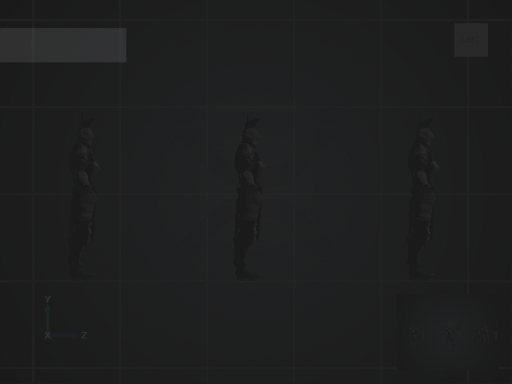

### Switch projection modes

You need to switch the projection modes to view the objects in your scene from different dimensions. To switch between perspective and orthographic projection modes, click the view camera gizmo cube while you are facing it.

The following animation shows how to switch between perspective and orthographic projection modes.

   

   _Switch between perspective and orthographic projections_

## Editor camera settings

Using the editor camera settings, you can change the projection and orientation of the camera.

On the top-right corner of the Scene Editor tool bar, you can access the settings of the Scene Editor camera by clicking .

The following image displays the editor camera settings.

   

   _Scene editor camera settings_

### Projection

The first-half of the editor camera settings help you change the projection used by the camera to display the scene inside the Scene Editor.

Based on your work, you may want to either use the same projection for the Scene Editor as that of your game, or increase the [field of view](xref:field-of-view) while editing your scene.

The following table displays projection concepts and their description.

| Concept    | Description |
| --------- |-------------- |
|[Perspective projection](xref:perspective-projection)|Perspective projection is used for the camera. It is often used for 3D environments. In this projection, the objects far from the camera are displayed smaller than the objects close to the camera. |
|[Orthographic projection](xref:orthographic-projection)|Orthographic projection is used for the camera. It is often used for 2D environments. In this projection, the objects far from the camera are displayed in the same size as the objects close to the camera. |
|[Near plane](xref:near-plane)|It is the closest distance that the editor camera can see. |
|[Far plane](xref:far-plane)|It is the farthest distance that the editor camera can see. |
| Field of view|It is the angle of the camera used to display the scene in degrees (commonly called the field of view).|

The following image shows a scene displayed with a perspective and orthographic projection.
 
   
   
   _Scene displayed with a perspective projection Scene displayed with an orthographic projection_
 
### Orientation

The second-half of the editor camera settings help you set the orientation of the camera to the preset angles.

The following table displays the information on various camera orientations.

Orientation    | To look at the scene
---------------|--------------
Front          | From the front
Back           | From the back
Top            | From above
Bottom         | From below
Left           | From the left
Right          | From the right   