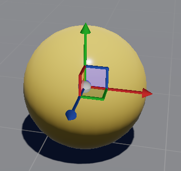

# Arrange Entities

Beginner
Level Designer

To build the levels of your game, you need to **move, rotate, and resize** the entities of your scene. 
The Game studio provides you with tools named **gizmos** to perform these operations.

This page will show you how to use those gizmos to adapt the entities of your scene and build a full game level.

## Transformation Gizmos

You can find the transformation gizmo tool box at the top of the scene editor.

There are three types of the transformation gizmo:
- The **translation gizmo**: allow you to move your entities
- The **rotation gizmo**: allow you to rotate your entities
- The **scale gizmo**: allow you to scale your entities

Only one type of gizmo can be active at a given type. 
To adjust your entities and build a full scene you need to constantly switch between the different types of gizmos.

To display the transformation gizmos in the scene, simply select one or several entities. 
The currently active transformation gizmo appears at the origin of the entities.

### Translation gizmo

Use the  icon to activate the translation gizmo.

The Translation gizmo allows you to **move selected entities** in your scene.

You can either move them along a single axis, along a plane or freely in 3D depending on the region of the gizmo clicked.
To move your entities, click on the tranlation gizmo and drag the entities in the desired direction.

The following video shows how you can translate an entity along one axis, a plane and freely in 3D.

<video controls autoplay loop height="360" width="480">
                <source src="media/manage-entities-in-scene-translation-gizmo.mp4" type="video/mp4">
</video>

_Video: Translate an entity_

### Rotation gizmo

Use the  icon to activate the rotation gizmo.

The rotation gizmo allows you to **change the orientation of selected entities** of your scene.

The rotation gizmo allows you to rotate selected entities along one axis only.
To rotate your entities, click on the rotate gizmo and move the mouse cursor either along the screen X or Y axis.

The following video shows how you can rotate an entity along one axis.

<video controls autoplay loop height="360" width="480">
                <source src="media/manage-entities-in-scene-rotation-gizmo.mp4" type="video/mp4">
</video>

_Video: Rotate an entity_

### Scale gizmo

Use the  icon to activate the scale gizmo.

The scale gizmo allows you to **resize selected entities** of your scene.

You can either rescale them along one single axis or uniformly along the three axis depending on region of the gizmo clicked.
To resize your entities, click on the scale gizmo and move the cursor of the mouse along the selected axis.

The following video shows how you can scale an entity along one axis and along all three axes.

<video controls autoplay loop height="360" width="480">
                <source src="media/manage-entities-in-scene-scale-gizmo.mp4" type="video/mp4">
</video>

_Video: Scale an entity_

## Switching between gizmos

To switch between the gizmos, you can either click on the respective buttons in the scene editor tool box, or use keyboard shortcuts. 

To use the keyboard shortcuts, make the Scene editor active by clicking anywhere in the Scene Editor, then:

* Pressing the Spacebar - this switches between the Translate, Rotate, and Scale gizmos.
* Press the **W** key to switch to the Translation gizmo.
* Press the **E** key to switch to the Rotation gizmo.
* Press the **R** key to switch to the Scale gizmo.

## Change gizmo coordinate system

You can change the coordinate system in which the gizmo operates by using the scene editor tool box.

The following table displays the different coordinate bases possible:

| Coordinate System | Function |
| ------  |  ------  |
|  | Uses the world coordinate system for transformations. The X, Y, and Z axes are the same for every entity. |
|   | Uses the local coordinate system for transformations. The axes are oriented in the same direction as the selected entity. |
|  | Uses the current camera coordinate system for transformations. The axes are oriented in the same direction as the editor camera. |

**To change the coordinate system for a gizmo:**

1. Select an entity.
2. Click the button representing the required coordinate system.
   
> [!WARNING] 
> The Scale gizmo can work only in local coordinate system.

## Snapping gizmo actions

You can snap the action performed using the transformation gizmos by enabling the Snapping tool. 
This means that the amount of rotation, translation or scaling applied to your entity is rounded 
to the closest multiple of the number specified. 

For example, if you set the snap to grid value to 22.5 for rotating, your rotation action will be a multiple of 22.5: 0, 22.5, 45, 67.5, 90 etc.

Based on the gizmo you selected, the icon on the Snapping tool changes. 

| Icon | Function |
| --- | ---- |
|  | Snap translations to multiple of 1 |
|  | Snap rotations to multiple of 22.5 |
|  | Snap scale to multiple of 1.1 |

Now you know how to arrange the entities in your scene. Next you will learn how to move inside the scene editor.
See [Navigate inside the scene editor](navigate-in-the-editor.md).