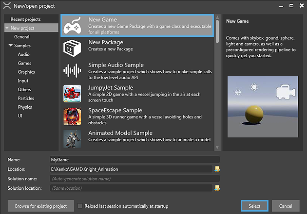

# Create a Project

Beginner

To start developing your game or application, you must first **create a project**.

This page will show you how to create a new empty project, and how to create a project based on a template or sample. 
**Templates** are projects that contain just the necessary **elements to start working** on a specific type of game. 
**Samples** are **complete games**, on which you can base your game, or use to learn from.

## Create an empty project

One way to start your game is to create an empty project. 

An **empty project** is project that contains only the **bare minimum** to make a game: 
a rendering pipeline properly set-up to your needs and an start-up scene comprised 
of a ground, a light, a camera, and script to move the camera.
Create an **empty project** when you want to **start your game from scratch** without having any non-essential elements in your initial game.

To create an empty game:

1. Start Xenko by clicking on launcher **Start Button**. This opens the *New Project* dialog.  
    
    
    > [!Note]
    > This dialog can also be reached from inside the Game Studio by clicking File > New.
    
2. Select **New Game** from the *New Project* dialog  
    In the bottom part of the dialog, the name and location of the project can be specified.

3. Click **Select**.  
    The *Create a new game* dialog opens. This dialog helps you configure your new project.
    

4. **Enter a value** for the *Namespace* you'd like to use, or leave unchanged if you're happy with the given suggestion.  
    > [!Note]
    > If you're not familiar with Namespaces, please refer to the [Introduction to scripting section](introduction-to-scripting.md). 
    > For now it's fine to leave this at it's default value.

5. **Select the platform(s)** you would like your game to support from the *Platforms* section.  
    If your development system does not have the required prerequisites installed for any of the selected platform, a warning message is displayed.
    > [!Note]
    >  To run your game on iOS and Android, you need to install <a href="https://www.xamarin.com/studio" target="_blank"> Xamarin </a> (free if you have Visual Studio).

6. **Select the desired options** from the *Rendering* section.  
    6.a. **Graphics API:** The graphics features that you can use in your game are dependent on the API that you select.  
        For advanced graphic features, select the latest version of the graphics APIs.
        > [!Warning]
        > Some graphics cards do not support the latest APIs. For some mobile devices, only DirectX 9.3 / 
        > OpenGL ES 2.0 and DirectX 10.0 / OpenGL ES 3.0 are available.

    6.b. **High or Low Dynamic Range (HDR / LDR):** This defines the way color is computed in your game.  
        In LDR mode, colors range from 0 to 1. In HDR mode colors can take any float value. 
        HDR enables you to have advanced and more realistic rendering in your game but requires 
        more processing power and at least profile DirectX 10.0 / OpenGL ES 3.0.

7. **Select the desired orientation** for your game in the *Orientation* section. For PC games, use landscape.  
    Portrait can be used for mobile-based games.

8. Click **OK**. 

## Instantiate a sample game

When you want to **learn** about a **specific feature** or want to **create a game similar** to an existing sample,
you can directly start your project from an existing sample project.

Xenko provides two types of sample project:

 * **Feature showcase samples**: They show how to use a specific feature.
 * **Mini-game samples**: They show how to use the different modules of the engine to create a simple game.
    
**To create a project from a sample:**

 1. Open the **New Project** dialog.
    
 2.	The left side of the dialog shows a tree of available project templates and samples. Navigate to **New project > Samples**
 
 2. **Select the sample** you'd like your project to be based on. 
    
   

 3. Click **Select**.

    
    	
 4. **Select the platforms** that you would like your game to support.

 5.	Click **OK**. 

 
> [!TIP] 
> An empty package can also be created to share assets and source code between projects. 
> A package is a library of components, such as assets and scripts. A package is not an executable 
> file like a game, but a container of files that can be shared among various projects along with its components.
 
A new game is created and opened in the **Game Studio**. Your project is now ready to be used. For more information on how to continue to add content to your project in game studio, see [Game Studio](game-studio.md).
