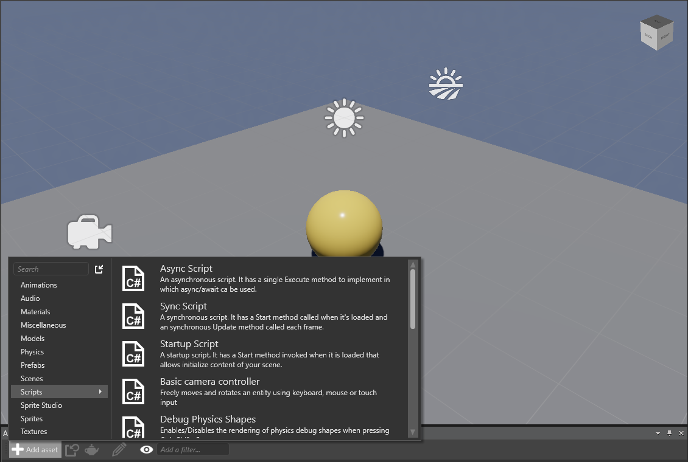
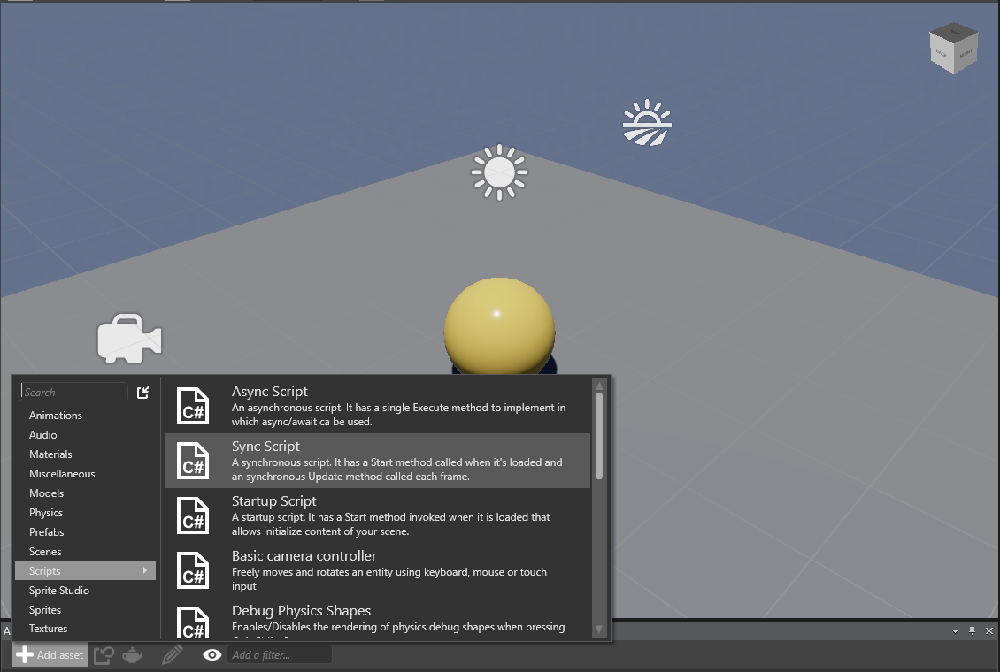

# Create a Script

<span class="label label-doc-level">Beginner</span>
<span class="label label-doc-audience">Programmer</span>

You’ve created a game and have added some entities to the game. 
Now, you have to add some scripts to your game to make your game more dynamic and interesting. 
There are two ways to add a script in Xenko: using Visual Studio, and using the Game Studio. 
We'll describe both below.

## Create a script in Visual Studio

The first method consists in adding a new script class in the game project from Visual Studio. 
Start by opening your game solution in Visual Studio by clicking the (Open in IDE) icon.

You will notice that your game solution is composed of several projects. 
The project ending in **.Game** is **the main project** of your game and should contain all your **game logic and scripts**. 
The other projects are the projects containing platform specific code. 
Typically you will find in those project the main entry point of your game for the given platform and possibly some OS related code.
The final extension name of the projects specify the targeted platform (e.g. *.Linux*, *.Android*, *.Windows*, etc).

**To create a script in Visual Studio:**

1. **Add a new class file** in the ```.Game``` project of your game solution. To add a new class, **right-click** on the project, 
   then click **Add** in the context menu, and finally click **New Item**.

2. In **Visual C#** items, select **Class**, **type the name** of your script and then click **Add**.

   A new class is added to your game.

4. **Open the file** that you have created. 
   Make the script is **public** and **derive** from either **AsyncScript** or **SyncScript** manually. 
   Finally **implement** the needed **abstract method(s)**. 
   
Here is an example of what your file might look like when you've done that:

```
	using System;
	using System.Text;
	using System.Threading.Tasks;
	using SiliconStudio.Core.Mathematics;
	using SiliconStudio.Xenko.Input;
	using SiliconStudio.Xenko.Engine;
	
	namespace MyGame
	{
		public class SampleSyncScript : SyncScript
		{			
			public override void Update()
			{
				if (Game.IsRunning)
				{
					// Do some stuff every frame
				}
			}
		}
	}
```

**Load your new script in Game Studio**

Because your project has been modified outside of Game Studio, Game Studio needs to reload the new game assembly to show the changes.

1. **Save your project** and script files
2. Go to the Game Studio.
   
   A popup prompting you for reload of the assemblies.
   
      

3. Select **Yes** in the displayed dialog.

   The Game Studio adds your class script to your component list.

3. **Select the assembly** where you have added your script in the *Solution Explorer*.
   You should find your script in the Asset view window, ready to be used.

## Create a script in Game Studio

The second method is to create a script from Game Studio without using any other application.

**To create a script in Game Studio:**

1. On the **Asset view** tab, click **New Assets**, and then click **Scripts**.

   

2. Select a script type from the **Script Types** list. The new script is added to the **Asset view** tab.

   

   
  

Save your project and go to Visual Studio. You should be able to see the new script that has been added to your project.
```
using System;
using System.Text;
using System.Threading.Tasks;
using SiliconStudio.Core.Mathematics;
using SiliconStudio.Xenko.Input;
using SiliconStudio.Xenko.Engine;

namespace MyGame
{
	public class BasicAsyncScript : AsyncScript
	{	
		public override async Task Execute()
		{
			while(Game.IsRunning)
			{
				// Do some stuff every frame
				await Script.NextFrame();
			}
		}
	}
}
```

Now that you have learned how to create a script in Xenko, 
you can learn how to attach your script to entities to add behavior to them.
For information on how to use a script, see [Use a script](use-a-script.md).
