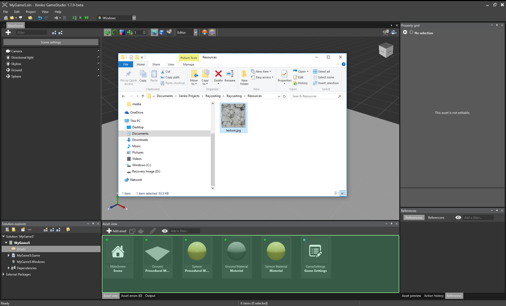
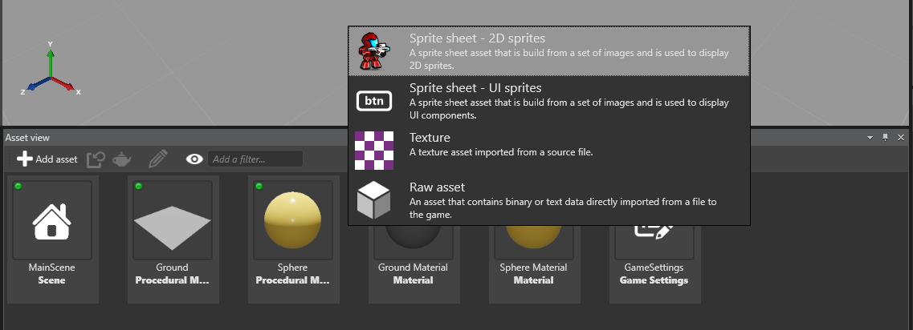

# Create Assets

Beginner

To add content to your game, you need first to create assets. This page will show you how to create assets in Game Studio.

Xenko provides two main ways to create assets for your game:
 * Create assets by using the 'Add Asset' button from the 'Asset View' tab.
 * Create assets by dragging and dropping resource files (images, audio, etc.) in the 'Asset view' tab
 
## Use the 'Add Asset' button

 1. In the 'Asset View' tab, click .
 
	A list of assets is displayed.

 2. Select a type of asset you would like to create.

	
 
	_Add asset using the 'Add Asset' button_
	
	A list of template appears. An asset template is an asset that is already preset for a specific use.
	
 3. Select the template that that is the closest to your needs. In this sample we'll create a procedural model by selecting 'Cube':

    The asset is added to the 'Asset View' tab.

	

	_Procedural Model added to 'Asset View' tab_

> [!Note]
> Some Assets require a source file, such as textures. When adding these Assets, 
> you will be prompted to select the required resource file in order to continue.	

## Drag-and-drop resource files

You can also create Assets by dragging and dropping resource files directly from Windows Explorer into the 'Asset View' tab.

> [!NOTE]
> By drag-and-dropping, you can create only create assets that takes a single resource file as input.

To create a asset file by drag-and-dropping:

1. Open the folder containing the resource file in Windows Explorer. 
   In theory if you properly copy the resource beforehand, this should always be the 'Resource' folder of your game.
   
2. Drag-and-Drop the resource file into 'Asset View' tab of the Game Studio.
  
   
   _Drap-and-drop resource in Game Studio_
  
   A list of asset template appears.
   
   
   _List of asset templates_

3. Select the adequate template.

   The asset is added to the 'Asset View' tab.
   
   
   _Texture asset created_

> [!Note] 
> When dragging and dropping multiple files of _different_ types (e.g. texture and sound files), 
> only the files that match your selection in step 3 will be added. I.e.: when adding sound and texture files, 
> and you select the 'Sound' Asset template, only the files that are sounds will be added.

> [!TIP]
> The Game Studio automatically imports all dependencies the input resource files and create corresponding assets.
> So you can just drag-and-drop the main resource file (model, animation, etc), and Game Studio handles everything else.

For the detailed list of resource that can be imported and more information about asset types and templates, see the reference.

Now that you’ve seen how to create assets to your game project, let's see you how to adapt the assets to your game. 
For information on asset edition and configuration, see [Manage assets](manage-assets.md).
