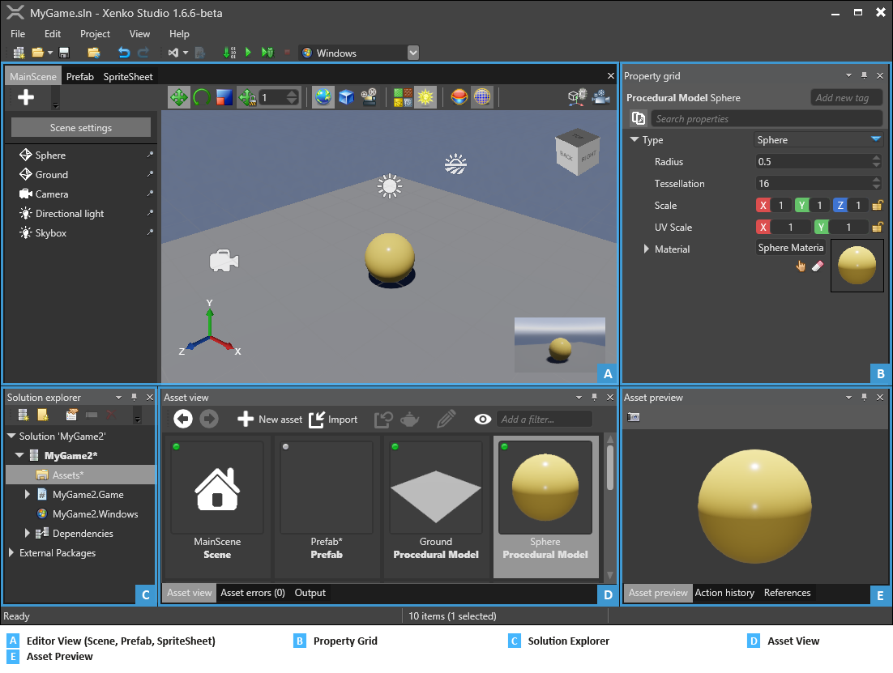

# Game Studio

Beginner

The Game Studio is the central tool for game and application production. 
Its main purpose is to create and manage content for your game, 
but it also allows you to configure, preview and launch your game.

This page will introduce you to the different views and tabs of the Game Studio. 

## Asset Editors 

The center area of the Game Studio window is dedicated to asset editors. 
Some asset types have their specific editor to enable more complex modifications of the asset. 
When there is an editor available for an asset type, you can open it by double clicking on the asset, 
or right clicking the asset and selecting 'Edit asset' in the context menu. 
The above image shows the Scene Editor.

## Property grid

The **Property grid** displays the properties of the selected asset or entity. 
From this tab, you can modify and adjust the properties of your game elements. 
By default, you can find this Property grid tap in the upper-right corner of the Game Studio window.

## Solution explorer

The **Solution explorer** tab displays the hierarchy of the elements of your game. 
It helps you browse your assets, code files, packages and dependencies. 
In this view you can create folders and objects, rename them and move them around.

> [!TIP]
> All assets are placed in the 'Asset' folder of the solution, 
> and all code (script) files should be put in the assembly they are part of.

## Asset view

You can find this tab at the bottom-center of the Game studio. 
It displays all the assets of your game; you can change the view to thumbnail view or more compact grid view. 
You can create new assets using the New Asset button or directly by drag-and-dropping resource files into the Asset view.
You can also drag-and-drop assets from the Asset view to the different editors and the property grid 
to either create a new instance of your asset, or add a reference to it. 

### Asset preview

This tab displays a preview of the selected asset, you can playback animations and sounds in the preview for instance. 
The preview changes based on the type of the asset you have selected. 
The Asset preview tab provides you with a quick and convenient way to visualize the changes made on an Asset when editing the 'Property grid'. 
You can find this tab at the bottom-right of the Game Studio.

Now you’re familiar with the Game Studio interface, let's see how to properly organize a project, see [Project structure](project-structure.md).
