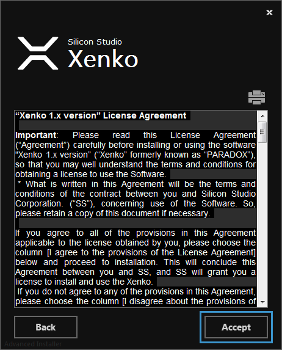

# Install Xenko

Beginner

Xenko is a powerful cross-platform Game Engine which helps to build games and applications that need game modules quickly and easily. Xenko contains modules such as (but is not limited to):

* High quality 3D rendering
* Physics Simulation
* Audio Engine

To work with Xenko Game Engine, you must first download the installer, and then install Xenko.

This page shows the steps to download and install Xenko Game Engine on your system.

## Download

You can download Xenko installer from the [Xenko website](http://xenko.com/download/) by clicking the **Download** button.

> [!NOTE]
> Requirements for Xenko can be found of the download page.

## Install

 1. Double-click the **XenkoSetup.exe** file.
 
    The **Xenko Setup Wizard** opens.

    

    _Xenko setup wizard_
	
 2. Click **Next**.
 
    The **Xenko License Agreement** window opens.

    

    _Xenko license agreement window_
	
 3. Click **Accept**.
 
    The **Xenko installation type** window opens.

    

    _Xenko installation type window_
	
 4. Select an installation type, and click **Next**. 

    The **Select installation folder** window opens.

    

    _Select installation folder window_
	
 5. Select a destination folder, and click **Next**.

    The **Create application shortcuts** window opens.
    
    
    
    _Create application shortcuts window_
	
 6. Select the options to create shortcuts, and click **Next**.
 
    The **Ready to Install** window opens.
    
    
    
    _Ready to install window_

 7. Click **INSTALL**.
 
    Installation begins. You can see the status of installation on the installation window.
 
    
    
    _Installation status_

After the installation has finished, the [Xenko launcher](xenko-launcher.md) opens. Shortcuts are created for Xenko in the selected locations.

Now, you're ready to start using the [Xenko launcher](xenko-launcher.md).
