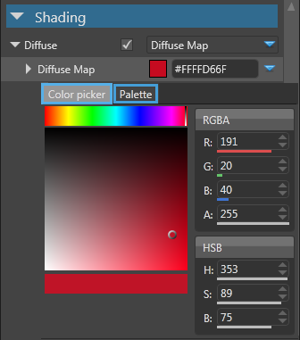

# Manage Assets

Beginner

After adding an new asset to your game project, you may need to make some changes to the asset in order to make it suitable to your game.

This page will show you how to configure, edit and manage your assets.

## Configure assets using the Property Grid

You can make simple asset modifications and configurations using the Property Grid tab in the top-right corner of Game Studio.

As an example, we will show you how to change the color of a Material.

 1. Select a material in the 'Asset View' tab. 
 
	
	
	The properties of the selected material appear in the 'Property Grid' tab.

 2. In the 'Property Grid' tab, find the **Diffuse** property under **Shading**.
 
 3. Click the colored box indicating the current color (yellow in this example), the color picker is displayed, allowing for easy selection of the diffuse color.
 
	
	
 4. Click the **Color picker** and select a red hue color or enter the hexadecimal value.
	
	After you set the color for the material, the color of the asset changes. 
	
	

> [!TIP]
> At all times, you can see your changes in real-time in the asset preview window.
	
## Edit assets using dedicated editors

Some assets are too complex to be modified from a property grid.
In this case, a specific editor is provided to edit and modify the asset in an intuitive way.
This is for example the case of the Scene, Sprite sheet and UI Page assets.

To open the editor of an asset, double click on the desired asset, right-click and select "Edit asset..." in the context menu,
or select the asset and type 'Ctrl+Enter'.

> [!NOTE]
> Some asset types are simple enough to be entirely configured from property grid and doesn't have dedicated editors.

Here is the example of the Scene Editor.

_Scene Editor_

For more information about the specific editors, see the corresponding sections in the manual reference.

## Organize Assets

As soon as your game starts getting big, you will need to organize your asset into folders. 
For that you can use the 'Solution Explorer' view at the bottom-left of the Game Studio.

All the assets of your package are contained under the 'Assets' folder. Expand this folder to see all the sub-folders of your game.

To create a new sub-folder:
1. Select the parent folder
2. Click on the icon or right-click and choose 'Create Folder' in the context menu.
3. Enter the name of the new folder and press enter.

To move asset to your new folder, select assets in the asset view and simply drag-and-drop them in the appropriate folder.

> [!NOTE]
> When moving assets, all reference to other assets contained inside the asset are automatically updated.

_Game project organized into sub-folders_

> [!TIP]
> You can see the URL, Type, and other details of an asset by keeping the mouse over the asset thumbnail a short time.
> 

> [!TIP]
> By default the asset view shows only the asset contained in the folder currently selected in the solution explorer.
> This behavior can be changed. For more information, see the reference manual of the Asset View.
 
## Include assets in build

The Game Studio doesn't include all your assets in the game database by default.

An asset is compiled and included into your game database only if one or more of the following conditions is fulfilled:
- you explicitly marked the asset to be included into the game build. 
- the asset is used by another asset that has to be included to the game build.

You can see which assets will be included to the game database by looking at the color of the top-left point on the thumbnail.

Color | Status
------|--------
 | Blue: The Asset has been marked as root asset and is included in the build.
 | Green: The Asset is included in the build, because it was referenced by another asset that is included in the build.
 | Gray: The Asset is not included in the build

Whenever you are planning to load and use your asset at run-time using scripts, start by checking that your asset is properly included your game database.

To mark an asset to be included in the game database, proceed as follow:
- Click on the gray point on the thumbnail, or
- Right-click and choose 'Include in build as root asset'
	
You’ve learned how to edit and manage assets. In the next section you'll learn how to use assets in your game, see [Use assets](use-assets.md)
