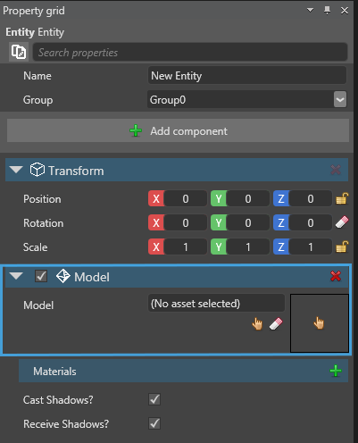
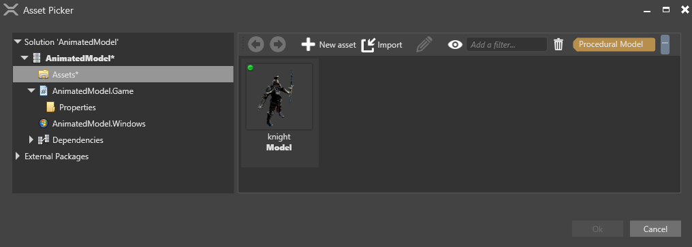
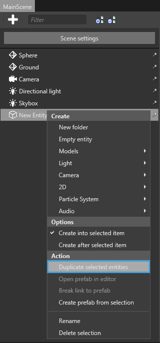
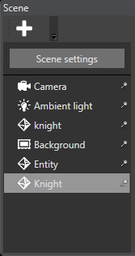

# Populate a Scene

After you create a scene, you can add entities to your scene to build your game level. You can add an entity to your scene in a couple of ways.

In this page, you’ll learn how to create an entity from an asset, add a new entity in the Scene explorer, and how to duplicate an existing entity with all its properties.

## Add an entity from Asset view

You can create a new entity by dragging an asset from the **Asset view** tab in the Scene Editor. The following video shows how to drag and place an entity onto the Scene Editor.

<video controls autoplay loop height="480" width="640">
   <source src="media/add-entities-to-scene-drag-and-place-entity.mp4" type="video/mp4">
</video>

_Video: Drag and place an entity_

When you add a new entity, Game Studio adds the corresponding components, such as model and texture automatically.

## Create an entity from the Scene explorer

You can add an entity from the Scene explorer. You can see the Scene explorer on the left side of the Scene Editor in Game Studio.

**To create an entity from the Scene explorer:**

1. On the **MainScene** tab of Game Studio, click . 

   A context menu opens.

   

   _Context menu of MainScene_

2. Select **Empty entity** from the context menu.

   An empty entity is created.

   

   _Empty entity in MainScene_

3. Click **Add component**, and then select **Model** to add a model component to the entity.

   

   _Add model component in Property grid_

   A model component is added.

   

   _Model component added in Property grid_

4. Click .

   The **Asset Picker** window opens. It displays various related components that can be selected as a model. Additionally, you can add new assets.

   

   _Add Procedural Model in Asset Picker window_

5. Select the **Model**, and then click **OK**.

   An entity is created. The selected model is assigned to the entity and displayed in the Scene Editor.
   
   >**Note:** To clear the assigned model component, click 

## Duplicate an existing entity

Instead of creating a new entity, you can also start from an existing entity by duplicating it, renaming it, and then modify its properties.

**To duplicate an existing entity:**

1. On the **MainScene** tab, right-click the entity in the Scene explorer.

   A context menu opens.

   

   _Duplicate selected entities in context menu_

2. Select **Duplicate selected entities**.

   The selected entity is duplicated with all its properties.

   >**Note:** Alternatively, you can select the entity to be copied, and then click the  gizmo. Use the mouse to drag the entity on the Scene Editor while keeping the **Ctrl** button pressed. A duplicate entity is created from the selected entity.

## Rename an entity

After you have duplicated an entity, Xenko assigns a default name to the duplicated entity. You can rename the duplicated entity as required, and then edit its properties.

**To rename an entity:**

1.	Select the entity and press **F2**.
2.	Type a name for the entity, and then press **Enter**.

   
   
   _Renamed entity in a scene_

Now that you are able to add entities to your scene, the next step is to move, rotate and scale your entites, see [Positioning entites](positioning-entities.md).
