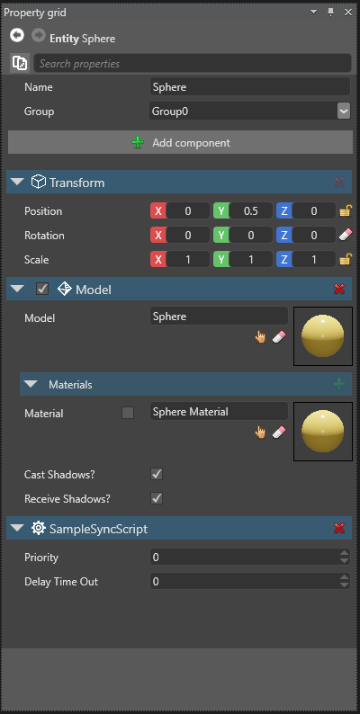

# Scripting in Xenko

<span class="label label-doc-level">Beginner</span>
<span class="label label-doc-audience">Programmer</span>

A script is a unit of code that enables you to add behaviors to your entities. 

In this page, you’ll learn what is a script, the different types of scripts in Xenko, 
and how to make certain properties of your script appear in the Game Studio so that artists can configure script parameters.

## Scripting and C#

In Xenko, all the scripting is done in C#, an advanced and efficient programming language.
The scripts are edited and debugged from Microsoft Visual Studio.

> [!NOTE]
> The learning of C# is out of the scope of this manual.
> To learn the C# programming language please refer to C# programming books or tutorials

This doesn't mean that all the C# code of your game are scripts.
A script is a C# class inheriting from the [ScriptComponent](xref:"SiliconStudio.Xenko.Engine.ScriptComponent") class.
A script can be attached to an entity from the editor and has access to the [ScriptContext](xref:SiliconStudio.Xenko.Engine.IScriptContext").

The script context gives access to all of the main modules of the engine:
* **Audio**: Gives access to the audio system.
* **Content**: Lets you load and save content from Assets.
* **EffectSystem**: Lets you load and compile effects and shaders.
* **Entity**: The entity to which the script is attached.
* **Game**: Gives you access to all information related to your game.
* **GraphicsDevice**: Gives you advanced access to the low-level graphics device, in order to create GPU resources.
* **Input**: Gives you access to keyboard, mouse and joypad states and events.
* **Services**: a registry of services that you can use to register your own services.
* **SceneSystem**: Gives you access to the currently displayed scene. Here you can manage Entities.
* **Script**: Gives you access to the script manager to schedule or await the termination of scripts.
* **Log**: Gives you access to the logging system, in order to log messages and errors from script.

These objects are described in more detail in the Xenko API reference.

Of course you can still use standard C# class in Xenko, but those classes are not called *Scritps*
and the Game Studio will not let you attach those class to entities or your scenes.

## Script Types

There are three main types of scripts in Xenko: Startup scripts, Synchronous scripts, and Asynchronous scripts. 
Each of these scripts has a precise function. 
When writing your script inherit from the script type that provides the most adequate behavior.

### Startup Script

This script is called at load time and unload time (e.g. when the attached entity is loaded and unloaded). 
It is used mostly to initialize certain game elements and destroy them when the scene is unloaded. 
It has a [Start](xref:"SiliconStudio.Xenko.Engine.StartupSctipt.Start") method for initialization and
a [Cancel](xref:"SiliconStudio.Xenko.Engine.ScriptComponent.Cancel") method for cancellation that should be override.

```
public class StartUpScriptExample : StartupScript
{
	public override void Start()
	{
		// Do some stuff during initialization
	}
}
```

### Synchronous Script

This script gets first initialized, then updated every frame and finally canceled.
The initialization code, if any, should be placed in the [Start](xref:"SiliconStudio.Xenko.Engine.StartupScript.Start") method.
The code performing the update should be placed in the [Update](xref:"SiliconStudio.Xenko.Engine.SyncScript.Update") method.
The code performing the cancellation should be placed in the [Cancel](xref:"SiliconStudio.Xenko.Engine.ScriptComponent.Cancel") method.
This script is used to perform updates that should happen every frames whatever happens.

```
public class SampleSyncScript : SyncScript
{        
	public override void Update()
	{
		// Performs the update on the entity - this code is executed every frames.
	}
}
```

## Asynchronous script

This script is asynchronous, it gets executed only once and then canceled when removed from the scene.
The asynchronous code should go inside the [Execute](xref:"SiliconStudio.Xenko.Engine.AsyncScript.Execute") function.
The code performing the cancellation should be placed in the [Cancel](xref:"SiliconStudio.Xenko.Engine.ScriptComponent.Cancel") method.
This script is used to perform actions that depends on events and triggers in the game.

```
public class SampleAsyncScript : AsyncScript
{        
	public override async Task Execute() 
	{
		// The initialization code should come here, if necessary
		
		while (Game.IsRunning) // loop until the game finishes (optional depending on the script)
		{
			await MyEvent;

			// Do some stuff
			
			await Script.NextFrame(); // await the next frame (optional depending on the script)
		}
	}
}
```

## Using public properties and fields

In Xenko, all the public properties and fields automatically appears and can be set from the Game Studio.
This allows you or your artist to configure each instance of scripts attached to entities differently.

> [!WARNING] 
> In order to use a public property or field in Game Studio, it needs to be serializable. 

The following is an example of a script with a public property called DelayTimeOut:

```cs
public class SampleSyncScript : StartupScript
{
	// This public member will appear in Game Studio
	public float DelayTimeOut { get; set; }
}
```

The above script appears as following in the Game Studio.



If you don't want the field to appear in the Game Studio, you can either declare your member internal or private, or 
use the [DataMemberIgnore](xref:"SiliconStudio.Core.DataMemberIgnoreAttribute") attribute as follows:

```cs

	// This public property will not be available in Game Studio
	[DataMemberIgnore]
	public float DelayTimeOut { get; set; }
	
```

![Public property has been hidden with ```[DataMemberIgnore]```](media/scripting-in-xenko-public-property-with-datamemberignore.png)
   
Now that you've learned about the basics of scripting in Xenko, let's continue to [Create a script](create-a-script.md)
 