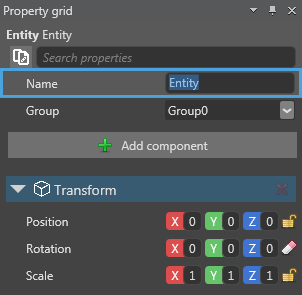

# Add entities to a scene

After you create a scene, you can add entities to your scene to build your game level. You can add an entity to your scene in a couple of ways.

In this page, you’ll learn how to create an entity from an asset of the **Asset view**, add a new entity in the scene hierarchy, and how to duplicate your existing entity with all its properties.

## Add an entity from Asset view

You can create a new entity directly by dragging an asset from the **Asset view** tab on the Scene Editor. The following video shows how to drag and place an entity onto the Scene Editor.

<video controls poster="media/xenko-poster-image-640by480.png" height="480" width="640">
   <source src="media/add-entities-to-scene-drag-and-place-entity.mp4" type="video/mp4">
</video>

_Video: Drag and place an entity_

You can see the **Asset view** tab at the bottom-center of Game Studio. After you select an asset from the **Asset view** tab, drag and place it on the [Scene Editor](xref:scene-editor).

When you add a new entity, Game Studio adds the corresponding [components](xref:component), such as model and texture automatically.

## Create an entity from hierarchy

You can add an entity from the hierarchy section. You can see the hierarchy section on the left side of the Scene Editor in Game Studio.

**To create an entity from the hierarchy section:**

1. On the **MainScene** tab of Game Studio, click . 

   A context menu opens.

   

   _Context menu of MainScene_

2. Select **Empty entity** from the context menu.

   An empty entity is created.

   

   _Empty entity in MainScene_

3. Type a name for the entity in the **Property grid** section.

   

   _Name entity in Property grid section_

4. Click **Add component**, and then select **Model** to add a model component to the entity.

   

   _Add model component in Property grid section_

   >**Note:** As this is an empty entity, you need to add the **Model** component first, and then you can add other components. Model component is a component to add a model to your empty entity.

   A model component is added.

   

   _Model component added in Property grid section_

5. Click .

   The **Asset Picker** window opens. It displays various related components that can be selected as a model. Additionally, you can add or import new assets.

   

   _Add Procedural Model in Asset Picker window_

6. Select the **Model**, and then click **OK**.

   An entity is created. The selected model is assigned to the entity and displayed on the Scene Editor.
   
   >**Note:** To clear the assigned model component, click 

## Duplicate an existing entity

Instead of creating a new entity, you can also start from an existing entity by duplicating it, renaming it, and then modify its properties.

**To duplicate an existing entity:**

1. On the **MainScene** tab, right-click the entity in the Hierarchy section.

   A context menu opens.

   

   _Duplicate selected entities in context menu_

2. Select **Duplicate selected entities**.

   The selected entity is duplicated with all the properties.

   >**Note:** Alternatively, you can select the entity to be copied, and then click the  [gizmo](xref:gizmo). Use the mouse to drag the entity on the Scene Editor while keeping the **Ctrl** button pressed. A duplicate entity is created from the selected entity.

## Rename an entity

After you duplicated an entity, Xenko assigns a default name to the duplicated entity. You can rename the duplicated entity as required, and then edit its properties.

**To rename an entity:**

1.	Select the entity and press **F2**.
2.	Type a name for the entity, and then press **Enter** on the keyboard.

   
   
   _Renamed entity in a scene_

The duplicated entity is renamed.

Now that you are able to add entities to your scene, the next step is to explore how to move around in your scene. For information on how to move around in your scene, see [Navigate in a scene](navigate-in-a-scene.md).