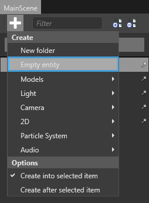
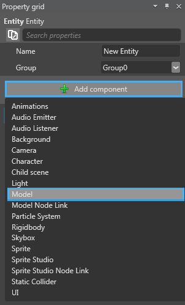
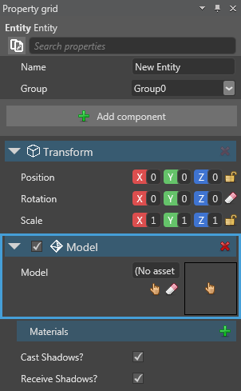

# Add Entities to a scene

Objects in a scene are called **Entities**. Each entity can have one or more components, such as model component, audio component, and other components. In this page you will learn how to add entities to a scene.

You can add entities to a scene in any of the following ways:
 * From the Asset view section of Xenko Studio
 * From the Hierarchy section of Xenko Studio
 * Duplicate and modify an existing entity

## Add an entity from Asset view

You can add an entity to your scene from the **Asset view** section. After you select an entity from Asset view, drag and place it on the Scene Editor of the main scene. You can add entities, such as model, prefab, texture, and other entities.
>**Note:** When you add a new entity, corresponding components, such as model and texture are created automatically.

## Create an entity from Hierarchy

You can add an entity from the Hierachy section. You can see the Hierarchy section on the left side of the Scene Editor in the Xenko Studio.

**To create an entity from the Hierarchy section:**

1. On the MainScene of the **Xenko Studio**, Click . 
    
   A context menu opens.
    
   

   _Context menu of MainScene_

2. Select **Empty entity** from the menu.
    
   An empty entity is created.

   

   _Empty entity in MainScene_

3. Type a name for the entity in the **Property grid**.

     

   _Name entity in Property grid_

4. Click **Add component**, and then select **Model** to add a model component to the entity.

   

   _Add model component in Property grid_

   >**Note:** As this is an empty entity, you need to add the Model component first, and then you can add other components. 

   A model component is added. 

   

   _Model component in Property grid_

5. Click the  icon.

   The **Asset Picker** window opens. It displays various related components that can be selected as a model. Additionally, you can add or import new assets. 
    
   

   _Add Procedural Model in Asset Picker_

6. Select the Procedural Model, and then click **OK**.

   The selected procedural model is assigned to the entity.

## Duplicate and modify an existing entity

You can create a new entity based on an existing entity by duplicating it.

**To duplicate an existing entity:**

 1. Right-click the entity.
    
   A context menu opens.
    
    

   _Duplicate selected entities in context menu_

 2. Select **Duplicate selected entities**.

   The selected entity is duplicated with all the properties. Rename the entity.

   >**Note:** Alternatively, you can select the entity to be copied, and then click the  gizmo. Use the mouse to drag the entity on the viewport while keeping the Ctrl button pressed. A duplicate entity is created from the selected entity. Rename the entity.

Now, you’ve added entities to your scene. The next step is to move the entities. For more information on how to move the entities in your scene, see [Move entities in a scene](http://doc.xenko.com/latest/manual/getting-started/howto-setup-a-basic-scene.html).
