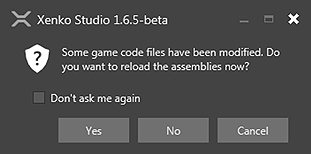
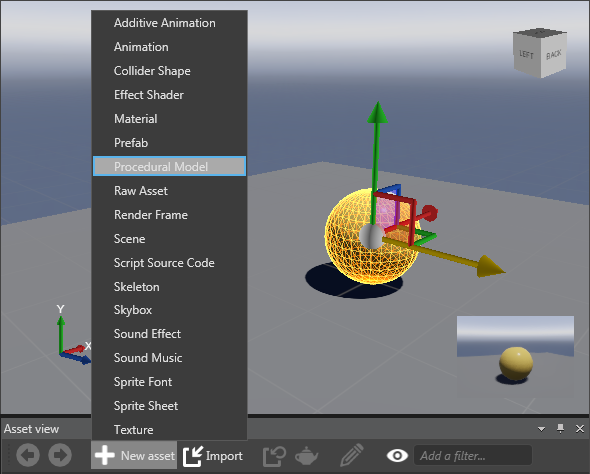
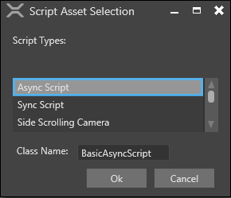

# Create a script

You’ve created a game and have added some entities to the game. Now, you have to add some scripts to your game to make your static game dynamic. There are two ways to add a script: In Visual Studio, and in the Game Studio. We'll describe both below.

## Create a script in Visual Studio

You can create a script in Visual Studio. On the tool bar of Game Studio, you can click the (Open in IDE) icon to open Visual Studio.

**To create a script in Visual Studio:**

1. Open Visual Studio, by clicking the 'Open in IDE' button  in the Game Studio toolbar.

2. Add a new class in the ```.Game``` extension of your project. To add a new class, right-click the ```.Game``` extension, click **Add**, and then click **New Item**.

3. In **Visual C#** items, select **Class**, and then click **Add**.

   A new class is added to your game.

4. Open the class that you have created. Make the script public and derive the new class from either AsyncScript or SyncScript manually and implement the needed abstract method(s). Here is an example of what your script might look like when you've done that:

```
	using System;
	using System.Text;
	using System.Threading.Tasks;
	using SiliconStudio.Core.Mathematics;
	using SiliconStudio.Xenko.Input;
	using SiliconStudio.Xenko.Engine;
	
	namespace MyGame
	{
		public class SampleSyncScript : SyncScript
		{			
			public override void Update()
			{
				if (Game.IsRunning)
				{
					// Do some stuff every frame
				}
			}
		}
	}
```

**Loading your new script in Game Studio**

1. Save your project and script files
2. Go to the Game Studio, and select **Yes** in the displayed popup prompting you for reload of the affected assemblies.

   

   _Confirmation message_

   Game Studio adds your class script to your [component](xref:component) list.

3. Select your entity. In the **Priority grid** section, click **Add component**, and then select the class that you created.

   

   _Add script in Add component_

## Create a script in Game Studio

You can create a script in Game Studio without using any other application.

**To create a script in Game Studio:**

1. On the **Asset view** tab, click **New Assets**, and then click **Script Source Code**.

   

   _TODO: create new screenshot, this one is misleading. New asset button on Asset view tab_

	The **Script Asset Selection** window opens.

   

   _Script Asset Selection window_

2. Select a script type from the **Script Types** list. The new script is added to the **Asset view** tab.

   

   _New script on Asset view tab_
   
   >**Tip:** You can edit the new script in the text editor, however we strongly encourage to use Visual Studio instead, as it gives more control over the overal project structure, and code. To edit the new script, right-click the script in the **Asset view** tab and then click **Open in Text Editor**. Update the script and then save.

```
    using System;
	using System.Text;
	using System.Threading.Tasks;
	using SiliconStudio.Core.Mathematics;
	using SiliconStudio.Xenko.Input;
	using SiliconStudio.Xenko.Engine;
	
	namespace MyGame
	{
		public class BasicAsyncScript : AsyncScript
		{	
			public override async Task Execute()
			{
				while(Game.IsRunning)
				{
					// Do some stuff every frame
					await Script.NextFrame();
				}
			}
		}
	}
```

Now, you’ve learned how to create a script in Xenko. You can use your script for an entity now. For information on how to use a script, see [Use a script](use-a-script.md).
