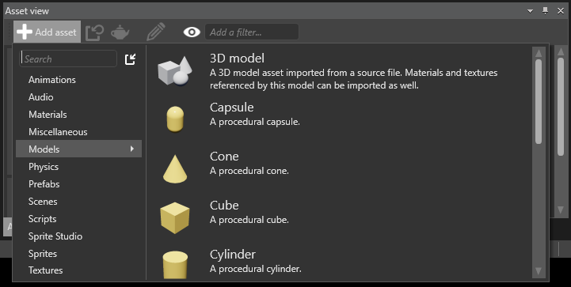

# Create and import assets

To add content to your game, you need to create [assets](xref:asset). An asset is a representation of an object of your game inside the Game Studio, such as a character of your game, environment of your game, a 3D image, a sound, and an animation.

In this page, you’ll learn how to create new assets and add assets in [Game Studio](xref:game-studio).

Xenko provides the following ways to create and import assets in your game:
 * Add assets from the **Asset view** tab
 * Add assets from the **Solution explorer** section
 * Import assets from a file
 
## Adding assets

To start with, you can add a basic asset from the **Asset view** tab. Later, you can customize the asset according to your requirements.

**To add an asset from the Asset view tab:**

 1. On the **Asset view** tab, click .
 
	A list of assets is displayed.

 2. Click an asset, for example, [Procedural Model](xref:procedural-model).

	
 
	_Add asset from Asset view tab_

	The asset is added to the **Asset view** tab.

	

	_Procedural Model added to Asset view tab_

After the asset is added to the **Asset view** tab, move your mouse pointer over the asset to see the URL, Type, and other details of the asset as a tooltip (for example, material, @texture, [sky box](xref:sky-box), and other details).
	
  
	
   _Details of new asset in Asset view tab_
	
	
You can modify the properties of the asset as per your project requirements through the **Property grid** section. For more information on how to edit an asset, see [Edit assets](edit-assets.md).

>**Note:** You can choose and add an asset also from the **Solution explorer** section. To add an asset from the **Solution explorer** section, in **Solution explorer** > right-click **Assets** > click **Create** > click an asset type. The selected asset is added to the **Asset view** tab.

You’ve learned how to create and add assets to your game project. You may want to customize the assets to suit your game environment. For information on editing assets, see [Edit assets](edit-assets.md).
