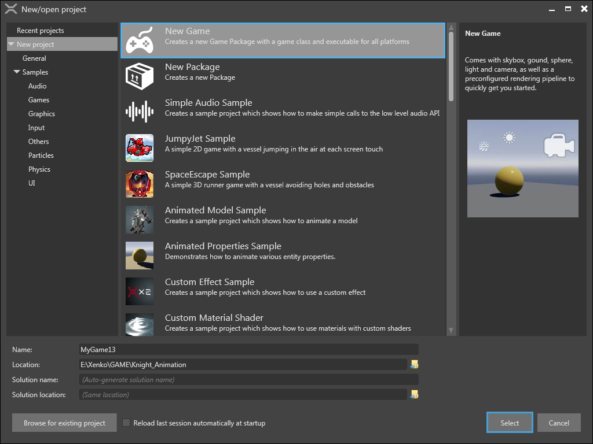

# Create a project

In this page, you will learn how to create a new project. 

Xenko provides two ways to create a project: you can create an empty project, or you can start with an existing sample. While creating a new project, you can:
 * Create a **New Package**
   >**Note:** A game package is a library of components such as assets and scripts. A game package is not an executable file like a game, but it can be shared among various projects along with its components.

 * Explore the **Samples** provided for graphics, audio, physics, UI, and other components along with the following two complete sample games:
   * JumpyJet, a 2-D scrolling game
   * SpaceEscape, a 3-D runner game

   You can check and explore these samples, that will help you learn how to work with the Xenko Game Engine faster.

**To create a new project:**

 1. On the **Xenko launcher**, click the Start button.
 
    
    
	_Start button of Xenko launcher_

   The **New/open project** window opens. This windows helps you select various options to create, such as, New Game, New Package, various Samples, open Recent projects, and preview of selected item.
   
 
   _New/open project window_

 2. Select **New Game**, and then click **Select**.

    The **Create a new game** window opens. This window helps you configure a new project.
    >**Note:** By default, a project name and location are added, For example: “MyGame13” and "```E:\Xenko\GAME\Knight_Animation```”. You can also add the Solution name and choose the Solution location.
	
	
 
    _Create a new game window_

 3. Type a name for your new game in the **Namespace** box.
 4.	Select a platform from the **Platforms** section. If your system does not have a particular platform installed, a warning message is displayed.
    >**Note:** You can build your game on iOS or Android only if you have Xamarin license.
 5. Select the configurations for graphic API and colors from the **Rendering** section.
    
	5.a. **Graphic API:** Select a graphic API from the list. The graphic features are dependent on the API that you select. For advanced graphic features, select the latest version of graphic API.
    >**Note:** Some of the graphic cards do not support the latest APIs. For mobile devices, restrict the selection to profile 9_1 or profile 10_0.

	5.b. **Colors:** Select a range of colors for your game. You can select either **Low dynamic range (LDR)** or **High dynamic range (HDR)**. LDR ranges from 0 to 1. HDR allows you to select any random float values. HDR gives more possibilities to select range, but it is complex.
 6. Select an orientation from the **Orientation** section.
    >**Note:** For PC games, use landscape. Portrait is suitable for mobile-based games.
 7. Click **OK**. 

A new game is created and opened in the **Xenko Studio**.

>**Note:** You can modify the parameters set while creating a new project in the Xenko Game Studio later. 

Your project is now ready. For more information on how a project is organized in Xenko, see [Project Organization](getting-started/project-organization.md).

