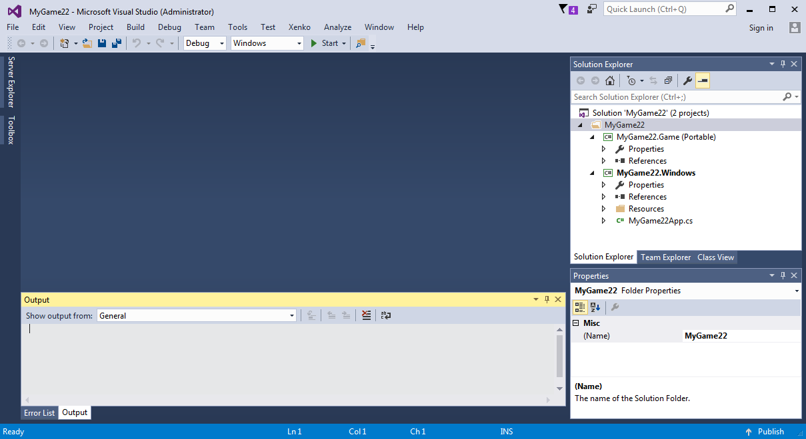
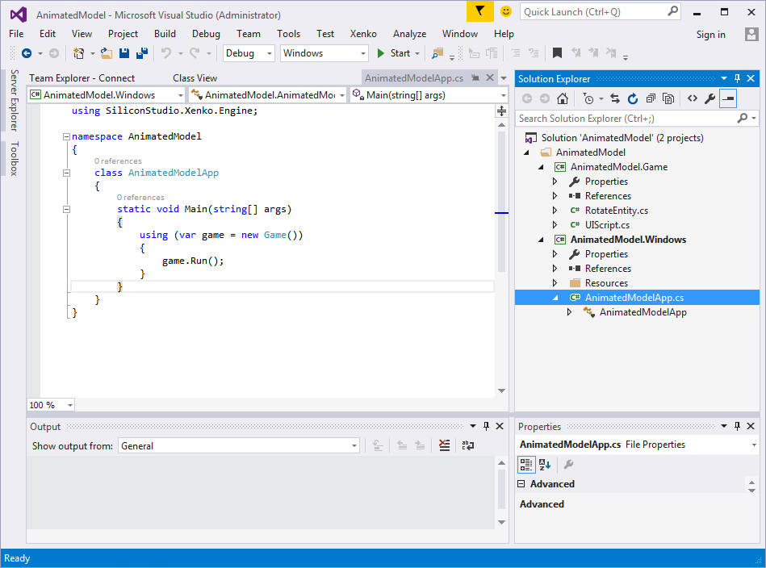
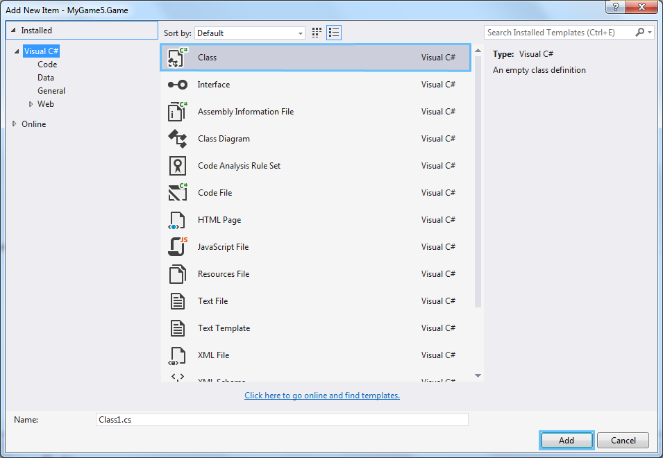
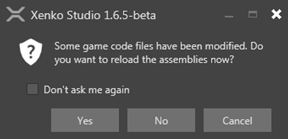
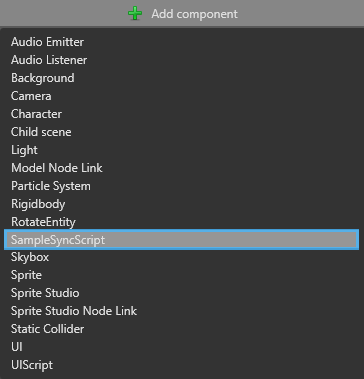
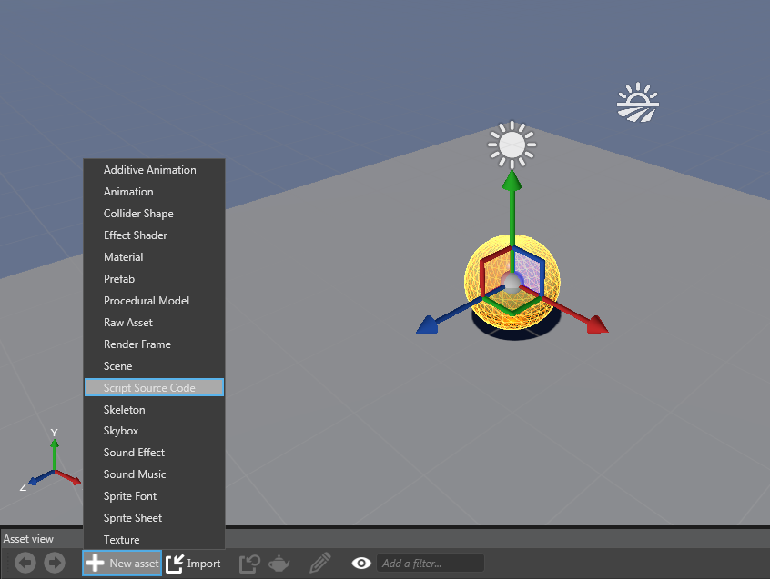
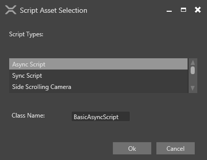
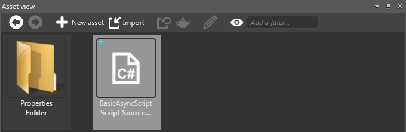

# Create a script

In this page, you will learn how to create a script. Xenko provides two ways to create a script: Create a script in Visual Studio, and create a script in Xenko Studio.

You have created a game and have added some entities to the game. Now, you have to add some scripts to your game to make your static game dynamic. A script is a unit of code that helps you to move your entities, control their movement, arrange events in your game, and respond to user inputs.

>**Note:** The scripts that you create can access the entire set of APIs created by the Xenko Game Engine for various purposes.

## Open your project in Visual Studio

You can open your existing project in Visual Studio using the Xenko Studio interface.

To open a project in Visual Studio:

1. Open Xenko Studio.
2. Click the  (Open in IDE) icon displayed below the menu bar.
   
   The project is opened in Visual Studio.

   
   
   _Project opened in Visual Studio_

## Create a script in Visual Studio

You can create a script in Xenko using Visual Studio.

To create a script in Visual Studio:

1. Open Xenko launcher.

2. Create a new game or select an existing game. For information on creating a new game, see [Create a project](getting-started/create-a-project.md)

3. On the menu bar, click **Project**, and then click **Open in IDE**.

   

   _Open in IDE in Project_

   The Visual Studio application opens.

   
   
   _Visual Studio application_
   
4. The game in Visual Studio by default creates two extensions: ```.Game``` and ```.Windows```.
   
   
   
   _Game extensions in Visual Studio_

5. Add a new class in the ```.Game``` extension of your project. To add a new class, right-click the ```.Game``` extension, click **Add**, and then click **New Item**.

   
   
   _Create a new class_
   
   The **Add New Item** window opens.
   
   
   
   _Add new item window_

6. In **Visual C#** Items**, select **Class**, and then click **Add**.

   A new class is added to your game.

7. Open the class that you have created. Make the script public and assign the type of script (AsyncScript or SyncScript) manually. Add a function to the code. Following is a code snippet with a function to transform the position of an entity.

```
using System;
using System.Collections.Generic;
using System.Linq;
using System.Text;
using System.Threading.Tasks;
using SiliconStudio.Core.Mathematics;
using SiliconStudio.Xenko.Input;
using SiliconStudio.Xenko.Engine;

namespace MyGame6
{
    public class BasicSyncScript : SyncScript
    {
        //declared public member variables and properties will show in the game studio

        public override void Update()
        {
            //do stuff every new frame
            if (Game.IsRunning)
            {
                Entity.Transform.Rotation = Quaternion.RotationY((float)Game.UpdateTime.Total.TotalSeconds);              
            }

        }
    }
}
```

8. From the **Build** menu, click **Build Solution** to build the current project.

9. After the build is successful, open your game in Xenko Studio, and then reload your project. To reload your project, on the **File** menu, click **Reload Project**.

The following confirmation message is displayed.

   
   
   _Confirmation message_
   
10. Click **Yes**.

   Xenko adds your class files to your component list.

11. Select your entity. On the **Priority grid**, click **Add component**, and select the class that you created.

   
   
   _Add script in Add component_
   
## Create a script in Xenko Studio

You can create a script in Xenko Studio without using any other application.

To create a script in Xenko Studio:

1. On the **Asset view** section, click **New Assets**, and then click **Script Source Code**.

   
   
   _New asset in Asset view section_

   The **Script Asset Selection** window opens.

   
   
   _Script Asset Selection window_

2. Select a script type from the **Script Types** list. The new script is added to the **Asset view** section.

   
   
   _New script in **Asset view** section_
   
>**Note:** The new script with the selected script-type will be automatically added to Visual Studio.

```
using System;
using System.Collections.Generic;
using System.Linq;
using System.Text;
using System.Threading.Tasks;
using SiliconStudio.Core.Mathematics;
using SiliconStudio.Xenko.Input;
using SiliconStudio.Xenko.Engine;

namespace MyGameDemo
{
    public class AsyncScriptDemo : AsyncScript
    {
        //declared public member variables and properties will show in the game studio

        public override async Task Execute()
        {
            while(Game.IsRunning)
            {
                //do stuff every new frame
                Entity.Transform.Rotation = Quaternion.RotationY((float)Game.UpdateTime.Total.TotalSeconds);
                await Script.NextFrame();
            }
        }
    }
}
```

>**Tip:** You can edit the new script in the text editor. To edit the new script, right-click the script and click **Open in Text Editor**, and then save it after making the changes.

Now, you have learned how to create a script in Xenko. You've to use your script for an entity now. For information on how to use a script, see [Use a script](getting-started/use-a-script.md).