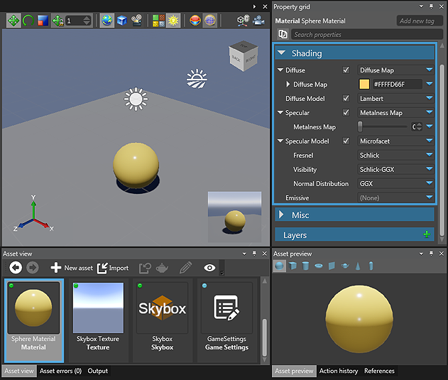

# Edit assets

After you add an asset to your game project, you may need to make some changes to the asset in order to make it suitable your your game environment.

This page will show you how to edit your game assets. As an example, you’ll change the color of a Sphere [Procedural Model](xref:procedural-model).

**To change the color of the Sphere Procedural Model:**

 1. On the **Asset view** tab, select the Sphere Material.
 
	

	_Sphere Material on the Asset view tab_
	
	The **Property grid** section shows the properties of the selected material.

 2. In the **Property grid** section, find the **Diffuse** property under **Shading**.
 
 3. Click the colored box indicating the current color (yellow in this example), the color picker is displayed, allowing for easy selection of the diffuse color.
 
		
 
 	_Color picker and Palette_
	
 4. Click the **Color picker** and select a red hue color or enter the hexadecimal value.
	
	After you set the color for the material, the color of the asset changes.
	
	

	_Asset appears in new color_
 
To remove the material from the Sphere asset, select the sphere asset, and click .

 
_Clear reference in Property grid_
	
You’ve learned how to edit an asset. You are now ready to create the first scene of your game project. For information on creating a scene, see [Scene creation](scene-creation.md).