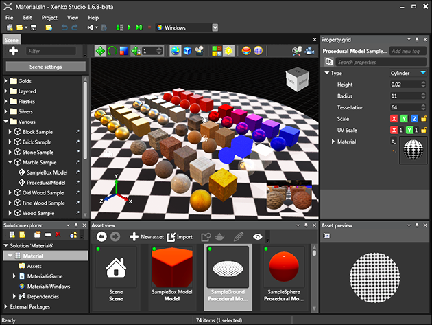

# Get started with Xenko

This chapter helps you get started with Xenko. After installing Xenko, you can start creating your first project and add your first assets. After that you can learn more about Game Studio, project structure, and find out how to write scripts. First start off by [installing Xenko](install-xenko.md)

   
   _Game Studio_
