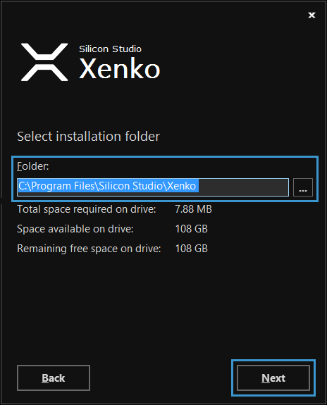

# Install Xenko

This page provides the steps to download and install Xenko Game Engine on your system.

## Download

You can download the Xenko Game Engine from the [Xenko website](http://xenko.com/download/).

Xenko website has a DOWNLOAD page which includes the pre-requisites for download, such as platform requirements, system requirements, licensing, and installer details. Click the **DOWNLOAD** button.

The Xenko application setup file is downloaded.

## Install

After the Xenko setup file is downloaded, you can install the Game Engine.

**To install Xenko:**

 1. Double-click the **XenkoSetup.exe** file.
 
    The **Xenko Setup Wizard** opens.

    

    _Xenko setup wizard_
	
 2. Click **Next**.
 
    The **Xenko License Agreement** window opens.

    

    _Xenko License Agreement window_
	
 3. Click **Accept**.
 
    The **Xenko installation type** window opens.

    

    _Xenko installation type window_

 4. Select an installation type, and then click **Next**. 

    The **Select installation folder** window opens.

    

    _Select installation folder window_
	
    The **Folder** text box displays the default path to install Xenko. To change the path, click  and select a path.

 5. Click **Next**.

    The **Create application shortcuts** window opens.
    
    
    
    _Create application shortcuts window_
	
 6. Select the options to create shortcuts, and then click **Next**.
 
    The **Ready to Install** window opens.
    
    
    
    _Ready to Install window_

 7. Click **INSTALL**.
 
    The **Installation Status** window opens.
    
    
    
    _Installation status_

After the installation is complete, the **Xenko launcher** opens. 

Now, you're ready to start using the Xenko launcher. For more information on how to use Xenko launcher, see [Xenko launcher](xenko-launcher/work-with-xenko-launcher.md).
