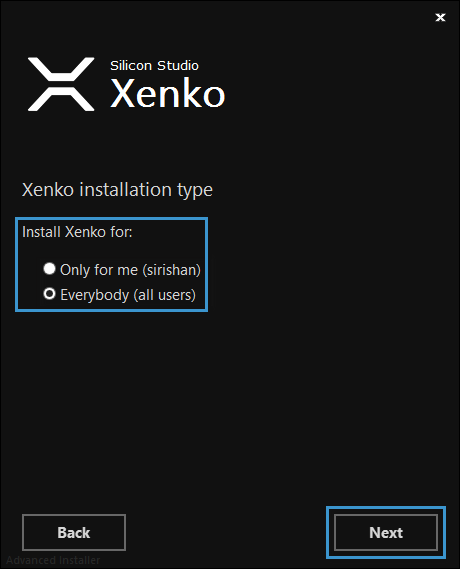

# Install Xenko

Xenko is a powerful cross-platform [Game Engine](xref:game-engine) which helps to build games quickly and easily. To work with Xenko Game Engine, you must first download the installer, and then install Xenko.

This page provides the steps to download and install Xenko Game Engine on your system.

## Download

You can download the Xenko Game Engine installer from the [Xenko website](http://xenko.com/download/).

The DOWNLOAD page of Xenko website includes the pre-requisites for download, such as platform requirements, system requirements, licensing, and installer details. 

Click the **DOWNLOAD** button. The Xenko application setup file is downloaded.

## Install

After the Xenko setup file is downloaded, you can install the Game Engine.

**To install Xenko Game Engine:**

 1. Double-click the **XenkoSetup.exe** file.
 
    The **Xenko Setup Wizard** opens.

    

    _Xenko setup wizard_
	
 2. Click **Next**.
 
    The **Xenko License Agreement** window opens.

    

    _Xenko license agreement window_
	
 3. Click **Accept**.
 
    The **Xenko installation type** window opens.

    

    _Xenko installation type window_
	
	>**Note:** Between the two installation types, you can choose either **Only for me** or **Everybody**.

 4. Select an installation type, and then click **Next**. 

    The **Select installation folder** window opens.

    

    _Select installation folder window_
	
	>**Note:** The **Folder** text box displays the location of the default folder to install Xenko. To change the location, click  and then select a location.
	
 5. Click **Next**.

    The **Create application shortcuts** window opens.
    
    
    
    _Create application shortcuts window_
	
	>**Note:** Among the three locations, you can choose any one or two or all to create shortcut for Xenko in your machine.
	
 6. Select the options to create shortcuts, and then click **Next**.
 
    The **Ready to Install** window opens.
    
    
    
    _Ready to install window_

 7. Click **INSTALL**.
 
    Installation begins. You can see the status of installation on the installation window.
 
    
    
    _Installation status_

After the installation is complete, the [Xenko launcher](xref:xenko-launcher) opens. Shortcuts are created for Xenko on the locations that you selected during the installation.

Now, you're ready to start using the Xenko launcher. For more information on how to use Xenko launcher, see [Xenko launcher](xenko-launcher.md).
