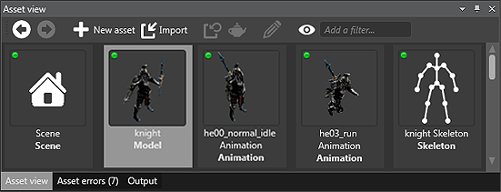

# Introduction to Assets

This section will discuss the following subjects:

* [Create Assets](create-assets.md) - creating Assets in Game Studio from files.
* [Manage Assets](manage-assets.md) - changing Asset properties to customize them, just the way you want.
* [Use Assets](use-assets.md) - loading and referencing Assets.

<small>For more advanced topics, please refer to [Assets](/manual/game-studio/assets.md) in the Game Studio documentation.</small>

An asset is a representation of any item that can be used in your project. An asset can be created from any file such as a model, a texture, an audio file, a material, or an animation. There are also Assets that are not based on any external file or resource, such as scenes and physics colliders.

This section will show you how to create Assets and the basics of Asset management.

_Different types of assets displayed in the *Asset view* tab_

You can create Assets by using the **Add asset** button or by directly dragging and dropping files in the Game Studio.

With the Asset view you can easily organize, search and visualize your Assets. Assets can be dragged and dropped in the Scene editor to start using them. Properties of the Asset can be set through the property grid in the top-left in Game Studio.

Let's continue to learn more about basic Asset concepts, see [Create Assets](create-assets.md).
