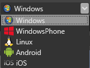

# Launch your game

When your game is ready, you will be curious to see what your game looks like. 

This page will show you how to start your game using either the Game studio or Visual Studio.

## Launch Game from Game Studio

  1. First select your target platform in the top of Game Studio.

  

  2. Click  to run or press **F5**.

  You can see the build status in the Output window. When the build has finished, your game will start in the selected platform.

> **Note:** Currently it is not possible to start your Game for the **Windows Store** and **Windows 10** platforms from Game Studio.

## Launch your Game from Visual Studio

1. Open Visual Studio: In Game Studio, click 

2. Select the profile you want to build and run for in the top. Note that the correct startup project will become active automatically.

	
   
3. To start the game with or without debugging:
   * Press **Ctrl + F5** to start the game without debugging
   * Click  or press **F5** to start the game with debugging.

   
   _Your running game_
   