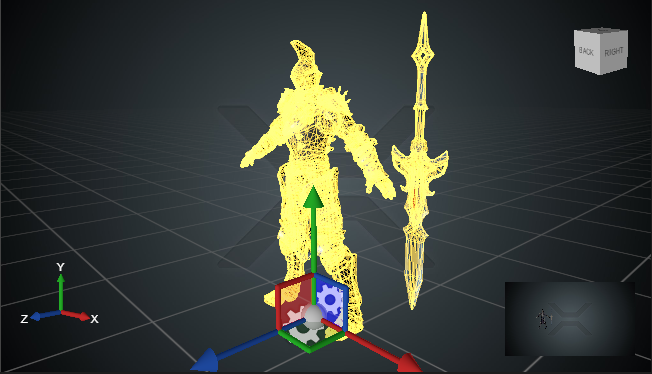
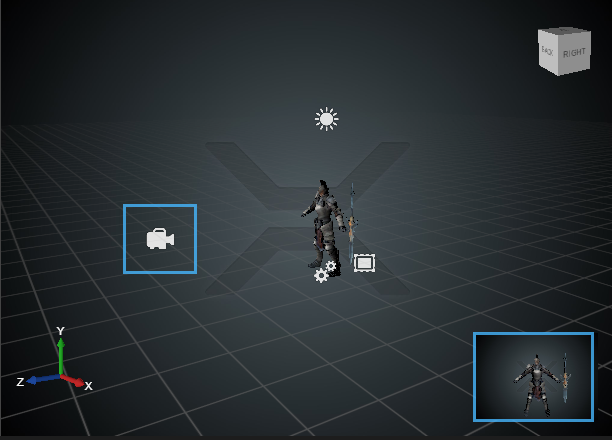
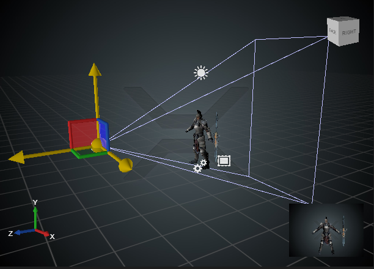
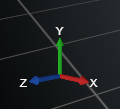

# Navigate in a scene

In this topic, you will learn how to navigate in a scene in Xenko Studio. You can explore the navigation options and see your scene and entities from various orientations and focus. This will help you move around efficiently in your scene.

Xenko provides some inbuilt navigation keys, mouse-clicks, and key combinations for easy navigation.

Navigating in a scene includes focusing on an entity, moving the scene, using the editor camera, and viewing your scene in various projections and orientations.

## Focus on an entity

In your scene, you may need to focus on your entity for a closer look. You can focus on an entity by first selecting that entity with a mouse-click, and then pressing the **F** key.

The following image displays a scene with an entity (Knight) selected.

   
   
   _Entity before focus_

The following image displays a scene with an entity (Knight) selected and focused.
  
   
   
   _Entity after focus_

## Move scene

Now you have positioned and focused your entity on the scene. You can modify your scene and its contents on the Scene Editor. For more information on the Scene Editor, see Working with Game Studio.

To move your scene in various directions, do any of the following:

* **Forward:** Keep any of the mouse buttons (the left or middle or right mouse button) pressed, and then press either the **W** key or the **Up** arrow key. 
* **Backward:** Keep any of the mouse buttons pressed, and then press either the **S** key or the **Down** arrow key.
* **To the left:** Keep any of the mouse buttons pressed, and then press either the **A** key or the **Left** arrow key.
* **To the right:** Keep any of the mouse buttons pressed, and then press either the **D** key or the **Right** arrow key.
* **Downward:** Keep any of the mouse buttons pressed, and then press the **E** key.
* **Upward:** Keep any of the mouse buttons pressed, and then press the **Q** key.

>**Note:** To make your scene movements faster, press the **Shift** button while using the combinations in the above list. For example, to move the orbital screen to the left faster, keep the **Shift** key and any of the mouse buttons pressed, while you press the **A** key.

## Camera

In a Scene Editor, you see through the editor camera. The editor camera shows your game view. You might have noticed the scene preview at the bottom-right of the Scene Editor.

   
   
   _Editor camera before selection_

>**Note:** In the above image, you see the camera because the above scene is in the edit mode. In the final scene, you will not see the camera.
   
   
   
   _Editor camera after selection and game preview_
   
On the Scene Editor, you can move the camera horizontally and vertically. To get the top view and bottom view of an entity, press the **Alt** key, and then use any of the mouse clicks to move the camera.

## Projection and orientation

You can adjust the display of the editor camera using the editor camera mode change icon  that appears at the top-right corner of the Scene Editor. You can see your scene in various orientations either in orthographic view or in perspective view.

To view the scene in various orientations:

1. Click the  icon.
2. In the **Projection** section, select either **Perspective** or **Orthographic**.
3. Click an orientation (**Front**, **Back**, **Top**, **Bottom**, **Left**, and **Right**).

   
   
   _Projection and Orientation_

The Scene Editor displays the scene in the selected orientation either in orthographic or perspective view based on your selection.
   
You might have also noticed the X, Y, and Z axes on the bottom-left corner of the Scene Editor. They help you know respective orientations in a scene.

   
   
   _XYZ axes_

You can use the cube that appears at the top-right corner of the Scene Editor to easily navigate between front, back, top, left, right, and bottom views of your scene. You just need to click a face of the cube to have that particular view. For example, click the top face of the cube to have a top view.

   
   
   _Cube_

Now you have explored how to focus on an entity, how to move a scene, how to use the camera in a scene, and how to view your scene in various projections and orientations. You can start adding more entities and check how can you move, rotate, and resize your entities. For information on how to add entities to your scene, see Add entities to a scene. 
