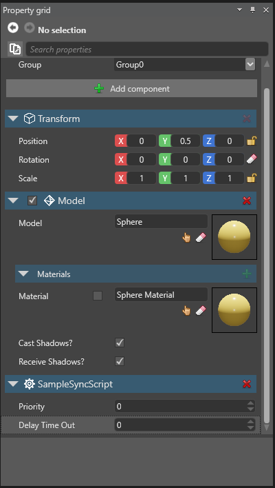

# Scripting in Xenko

In this page, you’ll learn how to use a [script](xref:scripting) in your game, about the different types of scripts used in Xenko, and how to make certain properties of your script appear in the Game Studio in order to configure script parameters.

## Scripting and entities

A script is a unit of code that helps to control their movement, handle events in your game, and respond to user input. All scripting in Xenko is done in C#, therefore you can use the C# programming reference, to find out about language specific information you might need.

A script can be attached to one or more entities. Multiple scripts can also be attached to a single entity. If you attach a script to multiple entities, multiple instances of that script are created. This allows for the same script to have different values for its public properties. You'll learn more about this subject later in this chapter.

There are a couple of Xenko specific base types from which you can derive your classes. These Xenko specific base classes can be used for functionality that needs to be called every frame, or just once at startup. Other scripts are free to have no base class, or derived from custom base classes, just like you're used to when programming in C#.

## Xenko specific types of scripts

Scripts can be classified into Startup scripts, Synchronous scripts, and Asynchronous scripts.

The following are the types of scripts with examples:

* **Startup script:** This script's ```Start``` method is called once during startup, and can be used to initialize certain game elements.

```
public class StartUpScriptExample : StartupScript
{
	public override void Start()
	{
		// Do some stuff during initialization
	}
}
```

* **Synchronous script:** The script's ```Update``` method is called each frame. Because the script is synchronous, execution of other scripts waits until the active script is done.

```
public class SampleSyncScript : SyncScript
{        
	public override void Update()
	{
		if (Game.IsRunning)
		{
			// Do some stuff every frame
		}
	}
}
```

* **Asynchronous script:** The script's ```Execute``` method is called each frame. Because the script is a-synchronous, execution of other scripts is not blocked.

```
public class SampleAsyncScript : AsyncScript
{        
	public override async Task Execute() 
	{
		while (Game.IsRunning)
		{
			// Do some stuff every frame
			await Script.NextFrame();
		}
	}
}
```

### Available Engine Modules

If a script is derived from either ```SyncScript``` or ```AsyncScript```, the script can access various Engine Modules of the Xenko framework:

* **Audio**: Gives access to the audio system.
* **Content**: Lets you load and save content from Assets.
* **EffectSystem**: Lets you load and compile effects and shaders.
* **GraphicsDevice**: Gives you advanced access to the low-level graphics device, in order to create GPU resources.
* **Input**: Gives you access to keyboard, mouse and joypad states and events.
* **SceneSystem**: Gives you access to the currently displayed scene. Here you can manage Entities.
* **Log**: Gives you access to the logging system, in order to log messages and errors from script.

These objects are described in more detail in the Xenko API reference.

## Using public properties

Public properties can be set from the Game Studio and allow to configure scripts with dynamic parameters from the Game studio. In order to use a public property in Game Studio, it needs to be serializable. 

The following is an example of a script with a public property called DelayTimeOut:

```cs
public class SampleSyncScript : SyncScript
{
	// Declared public member variables and properties will be shown in Game Studio
	public float DelayTimeOut { get; set; }
	
	public override void Update()
	{
		// Do some stuff every frame
	}
}
```



If you need to have a public property in your script, that should be hidden in Game Studio, use the ```[DataMemberIgnore]``` attribute as follows:

```cs
public class SampleSyncScript : SyncScript
{
	// This public property will not be available in Game Studio
	[DataMemberIgnore]
	public float DelayTimeOut { get; set; }
	
	public override void Update()
	{
		// Do some stuff every frame
	}
}
```

![Hide public property with [DataMemberIgnore]](media/scripting-in-xenko-public-property-with-datamemberignore.png)

_Public property has been hidden with ```[DataMemberIgnore]```_

## Script location

In your Visual Studio solution, you'll find a project ending in ***.Game***. Any scripts that are game specific (i.e. not ***Platform*** specific) should be placed in this project. Any scripts that are ***Platform*** specific should be placed in the project for the specific platform. Projects for platforms end in their platform name, for example: .Linux, .Android, .Windows etc.
   
Now that you've learned about the basics of scripting in Xenko, let's continue to [Create a script](create-a-script.md)
 