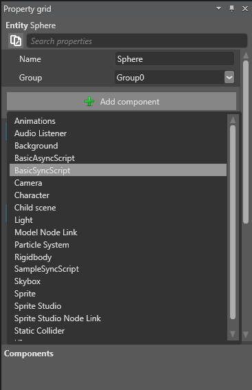

# Use a script

In this page, you will learn how to attach a script to an entity, how to test a script, and how to debug a script. 

Script is a piece of code that is used to perform different actions such as, entity movement, user input handling, and other actions. After creating a script, the next step is to use that in your game.

## Attach a script

You can attach a script to your entity either from the **Add component** section of Xenko Studio or through a code.

**To attach a script from the Add component section of Xenko Studio:**

 1. Create and build a script in Visual Studio.
 2. Open your project in the Xenko Studio.
 3. Open your scene, and then click the entity to which you want to attach a script.
 4. On the property grid, click **Add component**.

    All components are displayed.

 5. Click the required **script** to attach to the entity.

    

   _Attach script in Property grid_


**To attach a script through code:**

You can create a code and attach it to the required entity. 

 1. In Visual studio, create a script that includes the script name which you want to attach to the entity.

 2. Click **Save**. 

In following sample **BasicSyncScript** (Script name) is attached to **Sphere** (entity name). 

```
Code: 
var sphere = SceneSystem.SceneInstance.Where(x => x.Name.Equals("Sphere")).FirstOrDefault();

sphere.Add(new BasicAsyncScript());
```

## Test a script

You can test your script by running the game. Your script gets executed automatically when the entity to which you attached your script is loaded to the active scene.

**To test a script:**

 1. Open your game in Xenko studio.

 2. Click  to run your game.

You can see your entity works as per script.
## Debug a script

You need to debug your script if the script is not running properly or you are getting unexpected results.

**To debug a script:**

 1. Open Visual Studio, and then open the script.

 2. Press **F9** key to add break points at required places.

 3. On **Visual Studio**, Press **F5** or click **Start** button to run the game in debug mode.

    Your game starts in a new window. On Visual Studio, on the script page the first break-point highlights and stops the execution. 

 4. Verify the code.

 5. Press **F10** (step over) if you want to execute the code line-by-line or press **F5** to continue code execution.

Now, you know how to attach, test, and debug a script. You can try to launch your game. For more information on how to launch your game, see [Launch your game](launch-your-game.md). 
