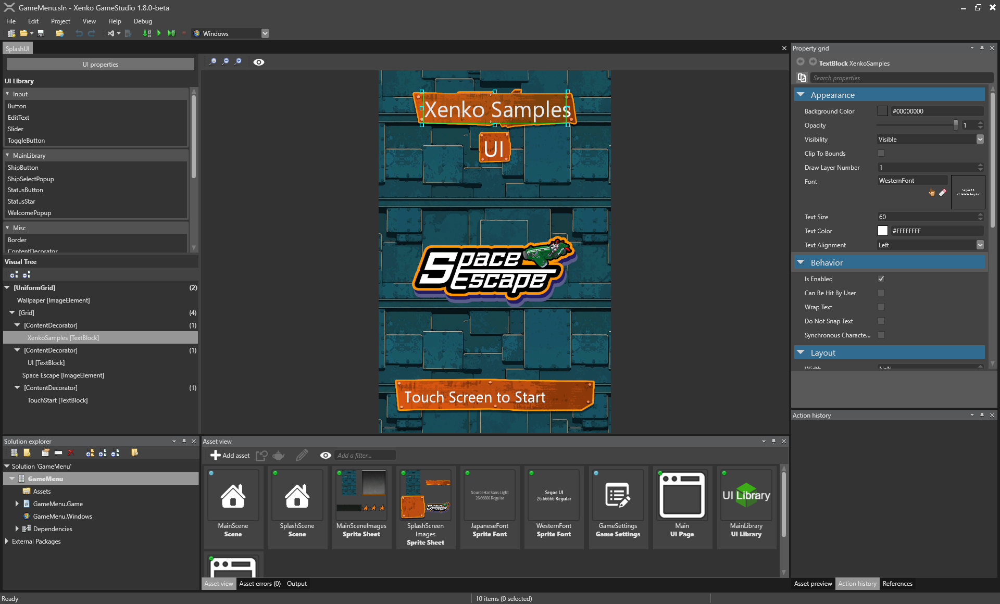
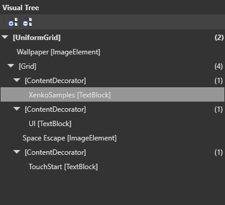
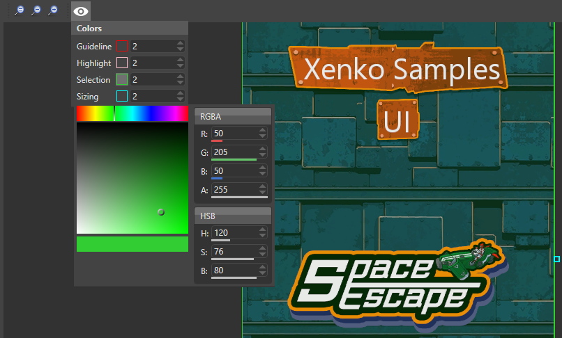

# Editing UI Assets

<div class="doc-incomplete"/>

## Assets and runtime counterparts
There are two type of assets for the UI: UIPageAsset and UILibraryAsset with their runtime counterparts
being respectively UIPage and UILibrary.

### UI Page
A UI page is a tree of UI elements. It contains the root UI elements and all its children.
The UI page can be assigned to the Page property of a UI component.

```csharp
// This property can be assigned from a UI page asset in the GameStudio
public UIPage MyPage { get; set; }

protected override void LoadScene()
{
    InitializeUI();
}

public void InitializeUI()
{
    var rootElement = MyPage.RootElement;
    // to look for a specific element in the UI page, extensions methods can be used
    var button = rootElement.FindVisualChildOfType<Button>("buttonOk");

    // if there is no element named "buttonOk" in the UI tree or the type does not match,
    // the previous method will return null
    if (button != null)
    {
        // attach a delegate to the Click event
        button.Click += delegate
        {
            // do something here...
        };
    }

    // assign the page to the UI component
    var uiComponent = Entity.Get<UIComponent>();
    uiComponent.Page = MyPage;
}
```

### UI Library
A UI library is similar to a prefab. It has several root elements that can be exported and reused in UI 
pages or other UI libraries. At runtime UI library roots can be instantiated and inserted into an existing UI
tree.

```csharp
// This property can be assigned from a UI library asset in the GameStudio
public UILibrary MyLibrary { get; set; }

public Button CreateButton()
{
    // assuming there is a root element named "MyButton" of type (or derived from) Button
    var button = MyLibrary.InstantiateElement<Button>("MyButton");

    // if there is no root named "MyButton" in the library or the type does not match,
    // the previous method will return null
    if (button != null)
    {        
        // attach a delegate to the Click event
        someButton.Click += delegate
        {
            // do something here...
        };
    }

    return button;
}
```

## Using the editor



The editor is composed of four parts:
* A list of available UI libraries
* The visual tree of UI elements
* A rendered view of the UI
* The property grid to edit the UI elements properties

### UI Asset properties


The resolution used at design time can be changed in the properties of the UI asset (for both UI page and UI
library). This is equivalent of the Resolution property of the UI component.

To edit the value click on the **UI properties** button in the UI editor or select the UI asset in the asset
view.

### UI Libraries

All the libraries that exists in the current project will appear in the list. Note that there is always at least
the standard library of all existing UI elements.

### Visual Tree

The visual tree represents the hierarchy of UI elements in the asset. For a UI page only one root element exists,
while a UI library can have several root elements.



When an element has child elements, the count of children will be indicated between parentheses on the right.
Clicking on the arrow on the left will expand or collapse the element depending on the current state.

The two buttons in the above toolbar allow to expand or collapse the whole visual tree.

Elements can be moved inside the visual tree with drag and drop. Note that some elements allow to have several
children (e.g. Panel such as Grid), while some can only have one child (e.g. Button).

#### Context Menu


When right-clicking on an element in the visual tree, a context menu will appear and offer several options.
Depending on the type of the selected element and also on the type of its parent, some options will or will not be
available.

* Layout category
  * *Group into*: the selected element(s) will be replaced by a panel (which type is selectable in a sub-menu) and
    added as children of this new panel.
  * *Ungroup*: all children of the selected panel will be move to its parent
  * *Change layout type*: the selected panel type will be change to another panel type (e.g. from a Grid to a 
    UniformGrid)
* Panel specific category (in case of the screenshot above, it is a UniformGrid)
  * Depending on the parent panel type, it will offer different options, such as moving the element to a different
    column
* Action category
  * *Rename*: to change the name of the selected element
  * *Delete selection*: remove the selected elements from the visual tree
  * *Duplicate selection*: will copy the selected element and all its sub-tree into a new sibling element (i.e.
    added as child of the same parent)
  * *Create page from selection*: create a new page asset containing a copy of the selected element (single
    selection)
  * *Create library from selection*: create a new library asset containing a copy of all selected elements (single
    or multi selection)

### UI View

The UI view provides a WYSIWYG experience. The rendering of this view is equivalent of the rendering in the final
game, assuming the design resolution is the same as the UI component that will use the edited asset (see 
[UI Asset properties](#ui-asset-properties)).

Note that the camera used for this view is orthographic and that the UI is set to always face the camera.

Zooming and panning is available by using the mouse wheel and clicking on the mouse middle button respectively.
Holding SHIFT during these operations will make it stronger to zoom or faster to pan.



The view toolbar offer options such as zooming in and out, resetting the view. Also changing the color of the
tools in the view (such as color of selection, sizing rectangle, etc.).

#### Selecting an element


UI element can be selected in the UI View by left-clicking.

#### Moving an element


To move an element, first select it then press the mouse left button, and while holding move the selected element.

#### Resizing an element


When selected, an element can be resized thanks to the eight small squares surrounding it.

### Property Grid

Once selected, the element properties are shown in the property grid. These properties are grouped by category.

#### Property categories

##### Appearance

This category contains the properties controlling the appearance of the UI element. Common properties include
`BackgroundColor`, `Opacity`, `Visibility`, `ClipToBounds`...

##### Behavior

This category contains the properties controlling the behavior of the element. Common properties include whether the
element will respond to touch events (`CanBeHitByUser`).

##### Layout

This category contains the properties controlling how the element is layed out. Common properties include the size
of the element (`Height`, `Width` and `Depth`), its alignment (`HorizontalAlignment`, `VerticalAlignment`,
`DepthAlignement`), `Margin`...

##### Misc

This category contains the `Name` property. 

## Creating a page

From the asset view toolbar, click on the **Add asset** button. In the drop-down menu, select the **UI**
category and click on **UI Page**. To open the newly created asset, either double-click on it, select it
and press CTRL+Enter, or click on the **Open this asset in editor** button from the property grid.

## Creating a library

From the asset view toolbar, click on the **Add asset** button. In the drop-down menu, select the **UI**
category and click on **UI Library**. To open the newly created asset, either double-click on it, select it
and press CTRL+Enter, or click on the **Open this asset in editor** button from the property grid.