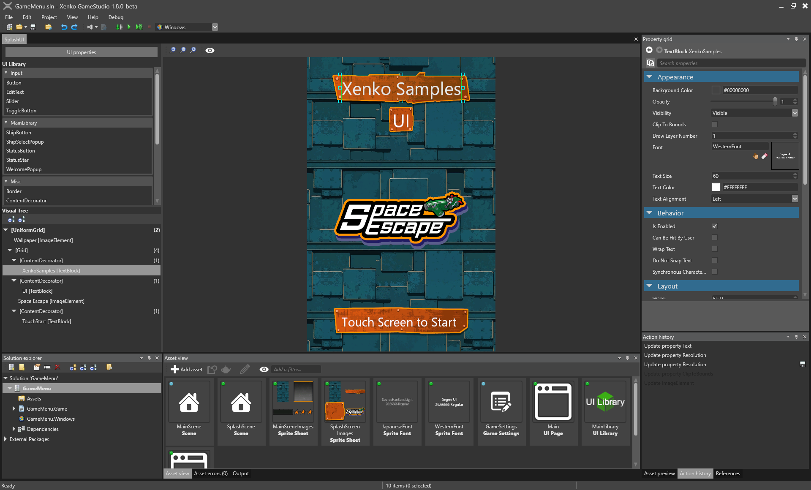

# Editing UI Assets

## Assets and runtime counterparts
There are two type of assets for the UI: UIPageAsset and UILibraryAsset with their runtime counterparts
being respectively UIPage and UILibrary.

### UI Page
A UI page is a tree of UI elements. It contains the root UI elements and all its children.
The UI page can be assigned to the Page property of a UI component.

```csharp
// This property can be assigned from a UI page asset in the GameStudio
public UIPage MyPage { get; set; }

protected override void LoadScene()
{
    InitializeUI();
}

public void InitializeUI()
{
    var rootElement = MyPage.RootElement;
    // to look for a specific element in the UI page, extensions methods can be used
    var button = rootElement.FindVisualChildOfType<Button>("buttonOk");

    // if there is no element named "buttonOk" in the UI tree or the type does not match,
    // the previous method will return null
    if (button != null)
    {
        // attach a delegate to the Click event
        button.Click += delegate
        {
            // do something here...
        };
    }

    // assign the page to the UI component
    var uiComponent = Entity.Get<UIComponent>();
    uiComponent.Page = MyPage;
}
```

### UI Library
A UI library is similar to a prefab. It has several root elements that can be exported and reused in UI pages or other UI libraries.
At runtime UI library roots can be instantiated and inserted into an existing UI tree.

```csharp
// This property can be assigned from a UI library asset in the GameStudio
public UILibrary MyLibrary { get; set; }

public Button CreateButton()
{
    // assuming there is a root element named "MyButton" of type (or derived from) Button
    var button = MyLibrary.InstantiateElement<Button>("MyButton");

    // if there is no root named "MyButton" in the library or the type does not match,
    // the previous method will return null
    if (button != null)
    {        
        // attach a delegate to the Click event
        someButton.Click += delegate
        {
            // do something here...
        };
    }

    return button;
}
```

## Using the editor



### UI Asset properties

### UI Libraries

### Visual Tree

### UI View

#### Selecting an element

#### Moving an element

#### Resizing an element

### Property Grid

#### Property categories

## Creating a page

## Creating a library